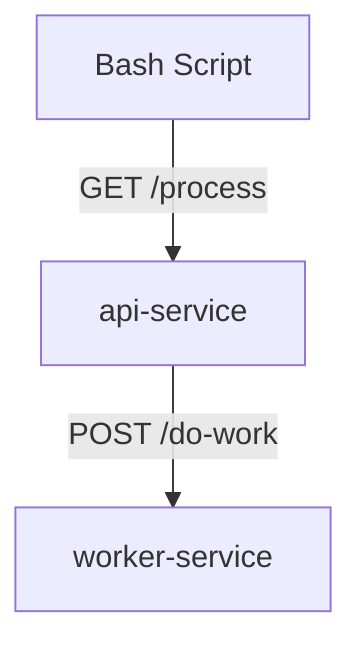

# 🧩 AirFund — DevOps Technical Test

Welcome to this **DevOps/SRE** technical test at **AirFund**.  
The goal is to assess your ability to **monitor**, **diagnose**, and **fix** a problem using **Kubernetes** only.

## 📜 Context

This stack includes 2 services:
- **`api-service`** (Go): an HTTP API that sends requests to the `worker-service`.
- **`worker-service`** (Python): performs the processing.
- A bash script `generate_request.sh` that sends a series of requests to `api-service` to **test the stability and robustness** of the stack under load.



It is deployed in a Kubernetes cluster with a functional monitoring stack (Grafana, Loki, Prometheus).

👉 In the current state, we are unable to achieve **100% success** for a series of 100 requests executed with this script.

## 🎯 Objective

Maximum duration: 1h  
1. [ ] **Create a Grafana Dashboard** to monitor the stack  
2. [ ] **Find and diagnose the problem** using this dashboard  
3. [ ] **Propose and apply a fix** using **Kubernetes only** (no code modification) to achieve **100% success** for a series of 100 requests executed with this script.

## ✅ Prerequisites

- [ ] Docker
- [ ] `kubectl`
- [ ] `kind` or `minikube` (recommended: `kind`)
- [ ] `skaffold`

## ✅ Steps to run the stack

1. Create a local cluster
   ```bash
   kind create cluster --name airfund-test
   ```

2. Deploy the stack
   ```bash
   skaffold dev
   ```

3. Once deployment is complete, the services are available on the following ports:
   - api-service: `http://localhost:8080`
   - worker-service: `http://localhost:8081`
   - grafana: `http://localhost:8082`
   
   The Grafana login credentials are:
   - username: `admin`
   - password: `devops@airfund2025`

4. Run the load test
   ```bash
   ./generate_request.sh 100
   ```

## 📝 Guidelines

- [ ] Do not modify the code of the services
- [ ] Explain your approach
- [ ] Internet and AI are authorized to search, compare or ask for advice
- [ ] If blocked, ask questions or ask for help

Good luck — show us how you observe, analyze and stabilize a system in real conditions 🚀

— AirFund Team